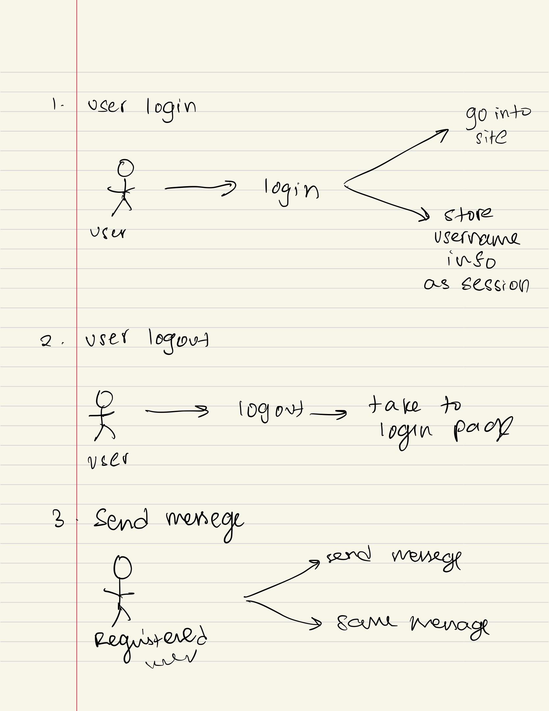
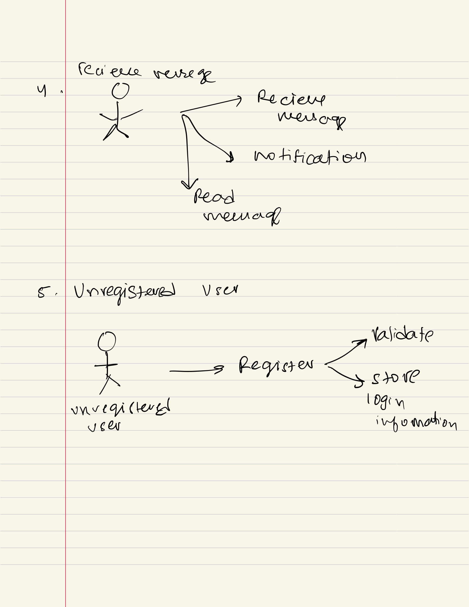

# cps490-23f-nstiffler1
*Description*: Group 4 Fall 2023 CPS 490  - Group Repository

## About

University of Dayton

Department of Computer Science

CPS 490 -- Capstone I -- Fall 2023

Instructor: Dr. Nick Stiffler

# Case Study: Messenger Application

## Team Members 

1. John Georgesen | georgesenj1@udayton.edu
2. Jaswant Prabhakaran | prabhakaranj1@udayton.edu
3. Harshita Madhavan Poonguzhali | madhavanpoonguzhalh1@udayton.edu
4. Akanksha Yadav | yadava5@udayton.edu

## Project Management Information

Management board (private access): <https://trello.com/b/SYB8SzCg/capstone-1>

Source code repository (private access): 

 John: <https://github.com/georgesenj1/cps490-23f-georgesenj1>
 Jaswant: <https://git@github.com:BiologyLab/cps490-23f-prabhakaranj1.git>
 Harshita: <https://github.com/harshita-mp/cps490-23f-madhavanpoonguzhalh1>
 Akanksha: <https://git@github.com:akankshary/cps490-23f-yadava5.git>

## Revision History

| Date     |   Version     |  Description    |
|----------|:-------------:|----------------:|
|9/12/2023 |  0.0          | Initial draft   |
|9/21/2023 |  0.1          | GP Assign 1     |
## Overview

This application facilitates registered users to communicate with each other by sending and receiving messages. For security and data integrity purposes, only registered users can send or receive messages. The user registration system ensures that users have a unique identity within the platform.

Describe the overview of the project with a high-level architecture figure. 

## System Analysis

### User Requirements

List user requirements of the project that the team will develop into use cases in later steps.

- User can register for access 
- User can Login 
- user can Logout
- Logged in user can send messege
- Logged in user can recieve messege
- Unregistered user cannot send or recieve messeges

### Use Cases

Register for Access
Actor: Unregistered User
Description: The user provides required details, such as username, password, to create an account and gain access to the messaging system.

Login
Actor: Registered User
Description: The user enters their username and password to access their account and utilize messaging features.

Logout
Actor: Registered User
Description: The user opts to exit their session, ensuring their account is secure from unauthorized access.

Send Message
Actor: Registered User
Description: The logged-in user selects a recipient, composes a message, and sends it to the chosen recipient.

Receive Message
Actor: Registered User
Description: The logged-in user can view and open messages sent to them by other registered users.

Restriction for Unregistered User
Actor: Unregistered User
Description: An unregistered user is restricted from sending or receiving messages. They must first register and login to access messaging features.

## Viable Technologies 
Tech Stack: MESN (MongoDB, Express.js, Socket.io, Node.js)

Advantages
- It enables bidirectional communication
- Makes simple applications such as live chat easy to implement
- Cross browser compatibilty
- Provides fallback for unsupported clients

Disadvantages:
- No UI components
- Scaling applications is very difficult
- Implementation for non-Websocket connection is complicated
- Further support is questionable

## System Design

### Use-Case Realization

_(Coming soon)_

### Database 

MongoDB

### User Interface

_(Coming soon)_

## Implementation

For each new sprint cycle, update the implementation of your system (break it
down into subsections). It is helpful if you can include some code snippets to
illustrate the implementation.

Specify the development approach of your team, including programming languages,
database, development, testing, and deployment environments. 

### Deployment

Describe how to deploy your system in a specific platform.

## Software Process Management

Include the Trello board with product backlog and sprint cycles in an overview
figure.

Also, include a Gantt chart that reflects the timeline from the Trello board.

### Scrum Process

#### Sprint 1

Duration: 10/20/2023-10/31/2023

#### USE-CASES:
● A user can register for access
● A user can login
● A user can logout
● A logged in user can send a message
● A logged in user can receive a message
● An unregistered user cannot send or receive messages

#### Functional Requirements
● A user can register for access (username & password)
● DO NOT STORE PASSWORD IN PLAIN TEXT
● A user can login
● A user can logout
● A logged-in user can access a “restricted” page/portion of the application that requires authentication.
● A user that is not logged-in is unable to access a “restricted” page/portion of the application that requires authentication.

#### What is needed
● Multipage application
● A page for the user to register
● A page for the user to login
● A page for sending and recieving messages
Note: This could be handled by a single page application but routing to different pages seems like an easier approach at the moment

##### Completed Tasks

1. Task 1
2. Task 2
3. ...

##### Contributions:

1.  Member 1, x hours, contributed in xxx
2.  Member 2, x hours, contributed in xxx
3.  Member 3, x hours, contributed in xxx
4.  Member 4, x hours, contributed in xxx

##### Sprint Retrospective

_Working through the sprints is a continuous improvement process. Discussing
the sprint that has just completed can provide insight/retrospection that will 
make future sprints more efficient. Sprint retrospection is done once a sprint is finished and the
team is ready to start another sprint planning meeting. This discussion can
take up to 1 hour depending on the team size.  Discussing
good things happened during the sprint can improve the team's morale, good
team-collaboration, appreciating someone who did a fantastic job to solve a
blocker issue, work well-organized, helping someone in need. This is to improve
the team's confidence and keep them motivated.  As a team, we can discuss what
has gone wrong during the sprint and come-up with improvement points for the
next sprints. Few points can be like, need to manage time well, need to
prioritize the tasks properly and finish a task in time, incorrect design lead
to multiple reviews and that wasted time during the sprint, team meetings were
too long which consumed most of the effective work hours. We can mention every
problem is in the sprint which is hindering the progress.  Finally, this
meeting should improve your next sprint drastically and understand the team
dynamics well. Mention the bullet points and discuss how to solve it.)_

| Good     |   Could have been better    |  How to improve?  |
|----------|:---------------------------:|------------------:|
|          |                             |                   |

## User Gude/Demo

Write as a demo with screenshots and as a guide for users to use your system.
