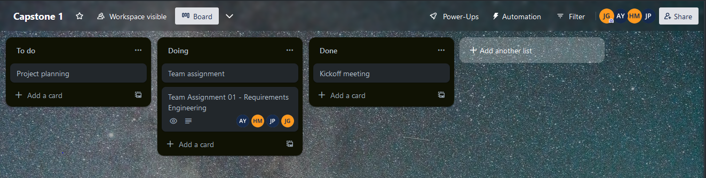
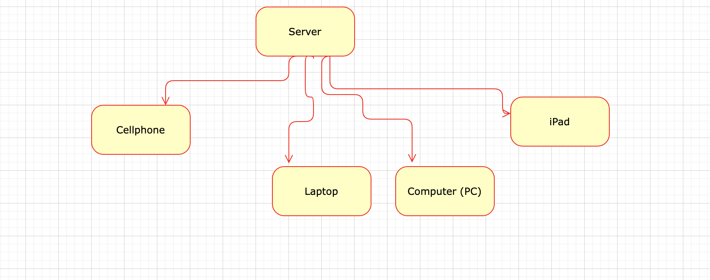
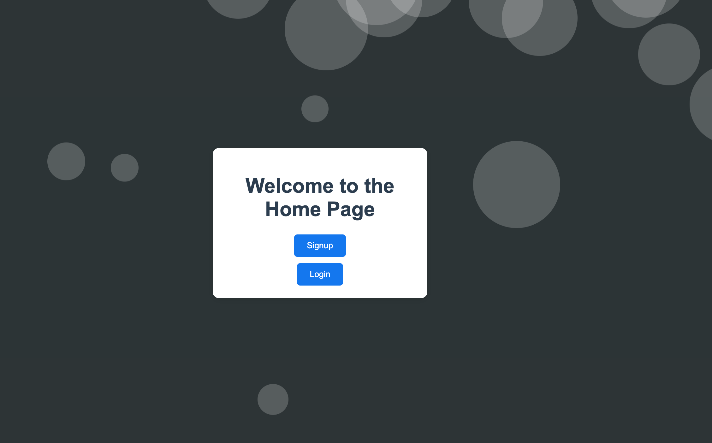
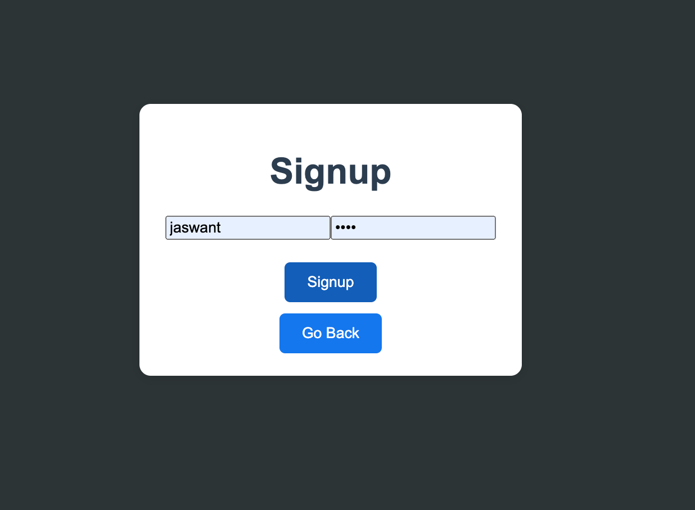
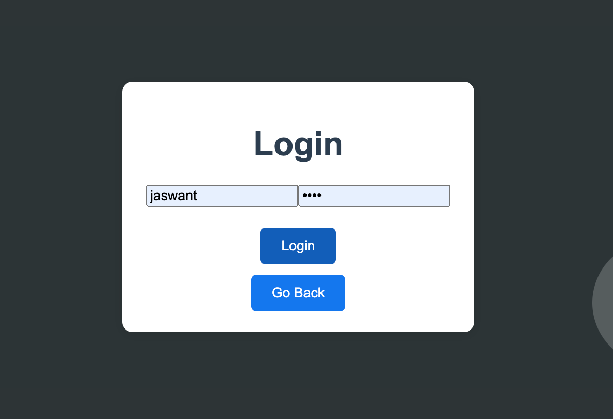
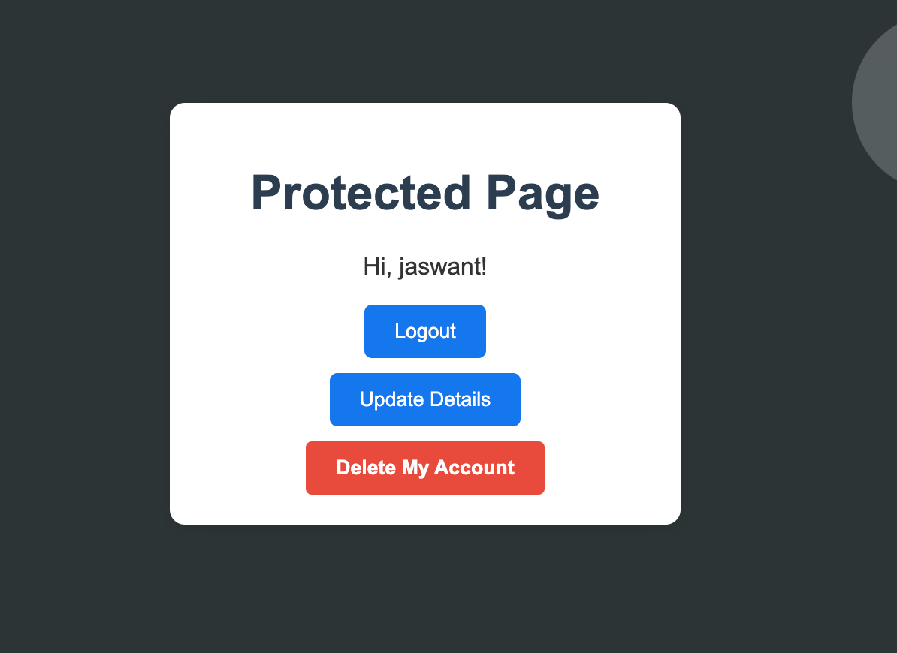
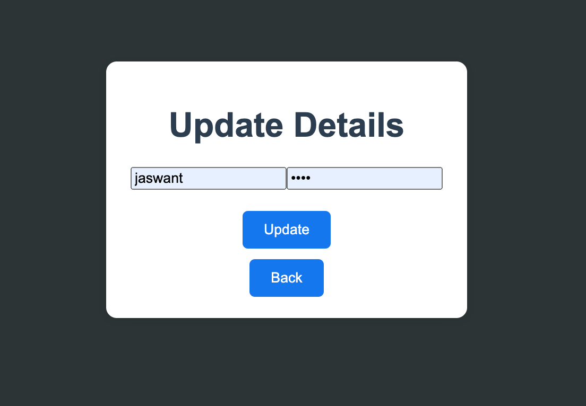
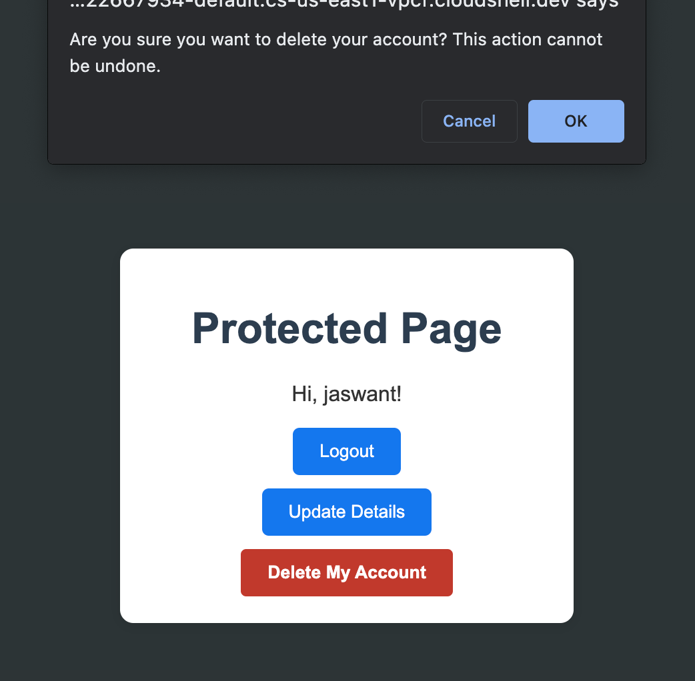

# cps490-23f-nstiffler1
*Description*: Group 4 Fall 2023 CPS 490  - Group Repository

## **About**

University of Dayton

Department of Computer Science

CPS 490 -- Capstone I -- Fall 2023

Instructor: Dr. Nick Stiffler

# **Case Study: Messenger Application**

## **Team Members** 

- Jaswant Prabhakaran | prabhakaranj1@udayton.edu
- Harshita Madhavan Poonguzhali | madhavanpoonguzhalh1@udayton.edu
- Akanksha Yadav | yadava5@udayton.edu

## **Project Management Information**

Management board (private access): <https://trello.com/b/SYB8SzCg/capstone-1>

Source code repository (private access): 

 - Jaswant: <https://git@github.com:BiologyLab/cps490-23f-prabhakaranj1.git>
 - Harshita: <https://github.com/harshita-mp/cps490-23f-madhavanpoonguzhalh1>
 - Akanksha: <https://git@github.com:akankshary/cps490-23f-yadava5.git>

## **Revision History**

| Date     |   Version     |  Description    |
|----------|:-------------:|----------------:|
|9/12/2023 |  0.0          | Initial draft   |
|9/21/2023 |  0.1          | GP Assign 1     |
|10/30/2023|  1.0          | App Version 1   |
## **Overview**

This application facilitates registered users to communicate with each other by sending and receiving messages. For security and data integrity purposes, only registered users can send or receive messages. The user registration system ensures that users have a unique identity within the platform.

## **System Analysis**

### **User Requirements**

List user requirements of the project that the team will develop into use cases in later steps.

- User can register for access 
- User can Login 
- user can Logout
- Logged in user can send messege
- Logged in user can recieve messege
- Unregistered user cannot send or recieve messeges
- Logged in user can update username and password
- Logged in user can delete account

### **Use Cases**

- **Register for Access**
Actor: Unregistered User
Description: The user provides required details, such as username, password, to create an account and gain access to the messaging system.

Sequence Diagram:

- **Login**
Actor: Registered User
Description: The user enters their username and password to access their account and utilize messaging features.

Sequence Diagram:

- **Logout**
Actor: Registered User
Description: The user opts to exit their session, ensuring their account is secure from unauthorized access.

Sequence Diagram:

- **Send Message**
Actor: Registered User
Description: The logged-in user selects a recipient, composes a message, and sends it to the chosen recipient.

- **Receive Message**
Actor: Registered User
Description: The logged-in user can view and open messages sent to them by other registered users.

- **Authorized Users can access the Restricted Page**
Actor: Registered User
Description: A registered user can access the restricted page after logging in. 

Sequence Diagram:

- **Restriction for Unregistered User**
Actor: Unregistered User
Description: An unregistered user is restricted from sending or receiving messages. They must first register and login to access messaging features.

Sequence Diagram:

- **Update Information**
Actor: Registered User
Description: A logged in user can update their information (username & password)

- **Account Deletion** 
Actor: Registered User
Descritption: A logged in user can request account deletion

## **Viable Technologies** 
**Tech Stack**: MESN (MongoDB, Express.js, Socket.io, Node.js)

**Advantages**
- It enables bidirectional communication
- Makes simple applications such as live chat easy to implement
- Cross browser compatibilty
- Provides fallback for unsupported clients

**Disadvantages**
- No UI components
- Scaling applications is very difficult
- Implementation for non-Websocket connection is complicated
- Further support is questionable

## **System Design**

### **Use-Case Realization**

_(Coming soon)_

### **Database** 

MongoDB

### **User Interface**

### **Implementation**

#### **Sprint Cycle 1**

##### **Features Implemented:**

- **User Registration:**
  We implemented a user registration feature where users can sign up for access. This was done using Node.js to handle the backend logic and Pug for the frontend rendering.

- **User Login:**
  Enabled users to securely login using their registered credentials. Again, Node.js was crucial for handling the authentication process, with Pug templates creating the user interface.

- **User Logout:**
  Users have the ability to log out, ensuring a secure end to their session.

- **Update Username and Password:**
  For better user experience, we ensured that logged-in users can update their username and password. This was implemented with a combination of Node.js functions and Pug templates for the frontend display.

- **Account Deletion:**
  To ensure user agency and data privacy, we added a feature that allows users to delete their accounts. This process was handled securely using Node.js, and Pug was used to present the user with confirmation prompts.
---

### **Development Approach**

#### **Programming Languages and Tools:**

- **Pug:** 
  - **Usage:** We employed Pug as our templating engine. This allowed us to efficiently render HTML content and create a dynamic frontend.
  - **Advantages:** Pug offers a concise way to write templates, allowing for better readability and maintainability.

- **Node.js:** 
  - **Usage:** Node.js served as the backbone of our application, providing the environment to run our JavaScript code server-side. This facilitated functionalities like user registration, login, updating credentials, and account deletion.
  - **Advantages:** Node.js offers an event-driven architecture capable of asynchronous I/O. This means our application is both scalable and can handle multiple simultaneous connections with high throughput.

---

### **Deployment**

#### **Deployment on Heroku**
Deploying your system on Heroku involves a series of steps to ensure that the application is correctly set up, integrated with any necessary services, and accessible to users.

- **Prerequisites**:
Before you begin the deployment process, ensure you have the following:

    - A registered account on Heroku.
    - Git installed, as Heroku uses Git for deploying applications.
    - The Heroku Command Line Interface (CLI) installed, which facilitates interactions with the Heroku platform directly from your terminal.

- **Preparing Your Application**:
Start by initializing your project directory as a Git repository if it isn't one already. Commit all your changes to ensure that everything will be pushed to Heroku.

- **Heroku Login**:
Use the Heroku CLI to log into your Heroku account. This step will link your local machine with your Heroku account, enabling direct interactions.

- **Create Heroku Application**:
With the CLI, you can create a new Heroku app. You can specify a name or let Heroku assign one for you. This step initializes a remote repository linked to your Heroku account.

- **Setting Environment Variables**:
If your application uses environment variables (like database URIs or secret keys), you'll need to set these up on Heroku to ensure your app functions correctly.

- **Add a Profile**:
Heroku requires a special file named Procfile in the root directory of your project. This file instructs Heroku on how to run your application, specifying the entry point.

- **Push to Heroku**:
With everything set up, push your application from your local machine to the remote Heroku repository. This step will trigger the building and deployment process on Heroku's end.

- **Scaling and Monitoring**:
Ensure that your application has the necessary resources (dynos in Heroku terms) to run. You might need to scale your application up or down based on traffic demands. Also, keep an eye on the application logs for any issues.

- **Accessing Your Application**:
Once deployed, your application will be accessible via a Heroku-provided domain. You can navigate to this URL to view your live application.

- **Additional Configurations**:
Some applications may require additional configurations, like linking to databases or other services. Heroku provides a range of add-ons and integrations that you can leverage for these purposes.

### **Software Process Management**

Include the Trello board with product backlog and sprint cycles in an overview
figure.

Also, include a Gantt chart that reflects the timeline from the Trello board.

### **Scrum Process**

#### **Sprint 1**

Duration: 10/20/2023-10/31/2023

#### **Use Cases:**
- A user can register for access
- A user can login
- A user can logout
- A logged in user can send a message
- A logged in user can receive a message
- An unregistered user cannot send or receive messages

#### **Functional Requirements**
- A user can register for access (username & password)
- DO NOT STORE PASSWORD IN PLAIN TEXT
- A user can login
- A user can logout
- A logged-in user can access a “restricted” page/portion of the application that requires authentication.
- A user that is not logged-in is unable to access a “restricted” page/portion of the application that requires authentication.

#### **What is needed**
- A page for sending and recieving messages

#### **Completed Tasks**

- A user can register for access
- A user can login
- A user can logout
- An unregistered user cannot send or receive messages

#### **Contributions:**

1.  Jaswant, 15 hours, contributed in Code, Documentation 
2.  Harshita, 15 hours, contributed in Code, Documentation
3.  Akanksha, 15 hours, contributed in Code, Documentation

#### **Sprint Retrospective**

#### USE-CASES:
● A user can register for access
● A user can login
● A user can logout
● A logged in user can send a message
● A logged in user can receive a message
● An unregistered user cannot send or receive messages

#### Functional Requirements
● A user can register for access (username & password)
● DO NOT STORE PASSWORD IN PLAIN TEXT
● A user can login
● A user can logout
● A logged-in user can access a “restricted” page/portion of the application that requires authentication.
● A user that is not logged-in is unable to access a “restricted” page/portion of the application that requires authentication.

#### What is needed
● Multipage application
● A page for the user to register
● A page for the user to login
● A page for sending and recieving messages
Note: This could be handled by a single page application but routing to different pages seems like an easier approach at the moment

##### Completed Tasks

1. Task 1
2. Task 2
3. ...

##### Contributions:

1.  Member 1, x hours, contributed in xxx
2.  Member 2, x hours, contributed in xxx
3.  Member 3, x hours, contributed in xxx
4.  Member 4, x hours, contributed in xxx

##### Sprint Retrospective

During this sprint, the team managed to work collaboratively, meeting most of the sprint objectives and ensuring the tasks were completed with diligence and efficiency. We were able to keep communication lines open, helping each other to overcome challenges and blockers.

**Good**:

Technical Selection: The combination of Node.js, Express, and Pug turned out to be beneficial. It allowed rapid development, facilitated server-client interactions, and rendered dynamic content efficiently.

Responsive Design: Our use of CSS ensured that the application was user-friendly and adaptable to various screen sizes.

Functionality: The features like registration, login, and account management (update and delete) were implemented seamlessly, enhancing user experience.

**Could have been better**:

Error Handling: While we did manage error messages effectively, there's always room for improvement in providing users with more detailed feedback.

Scalability: As the application grows, we may need to consider optimizing our Node.js server and possibly integrating more advanced database solutions for user management.

**How to improve**

Extend Tech Stack: Introduce more middleware in Express.js for better error handling and more efficient route management.

Enhanced Testing: Introduce automated testing tools specific to Node.js and Pug to ensure that every functionality works flawlessly before deployment.

Refined Styling: Further refine the CSS to ensure more responsiveness and introduce themes for users in the future.

## User Guide/Demo

- **Registration**

To use the messenger, start by registering for an account. Simply navigate to the Registration Page, enter your desired username and password, and click the "Register" button.

- **Login**

Returning users can access the system by logging in. Input your username and password, then click "Login". If the credentials match, you'll be taken to the protected page.

- **Protected Page**

Once logged in, you'll be greeted with a welcome message. From this page, you have several options, including logging out, updating your account details, or deleting your account.

- **Update Details**

Should you wish to change your username or password, click on "Update Details". Modify the desired fields and confirm by pressing "Update". Always ensure to remember the updated credentials for future logins.

- **Delete Account**

Users can choose to delete their accounts. By clicking the "Delete My Account" button, a confirmation prompt will appear to ensure you truly want to proceed. Remember, this action is permanent.

- **Logout**

To exit the system, click the "Logout" button. You will be taken to the login page and shown a notification confirming your successful logout.
