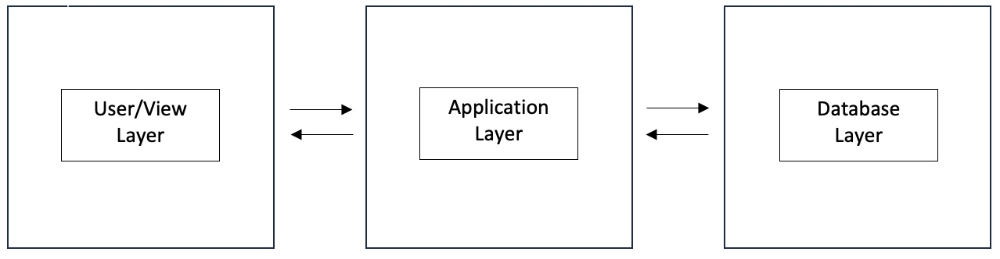
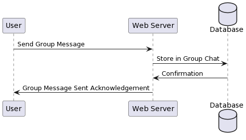

# cps490-23f-nstiffler1
*Description*: Group 4 Fall 2023 CPS 490  - Group Repository

## **About**

University of Dayton

Department of Computer Science

CPS 490 -- Capstone I -- Fall 2023

Instructor: Dr. Nick Stiffler

# **Case Study: Messenger Application**

## **Team Members** 

- Jaswant Prabhakaran | prabhakaranj1@udayton.edu
- Harshita Madhavan Poonguzhali | madhavanpoonguzhalh1@udayton.edu
- Akanksha Yadav | yadava5@udayton.edu

## **Project Management Information**

Management board (private access): <https://trello.com/b/SYB8SzCg/capstone-1>

Source code repository (private access): 

Source code repository (private access): 

 - Jaswant: <https://git@github.com:BiologyLab/cps490-23f-prabhakaranj1.git>
 - Harshita: <https://github.com/harshita-mp/cps490-23f-madhavanpoonguzhalh1>
 - Akanksha: <https://git@github.com:akankshary/cps490-23f-yadava5.git>


## **Revision History**

| Date     |   Version     |  Description    |
|----------|:-------------:|----------------:|
|9/12/2023 |  0.0          | Initial draft   |
|9/21/2023 |  0.1          | GP Assign 1     |
|10/30/2023|  1.0          | App Version 1   |
|11/26/2023|  2.0          | App Version 2   |
## **Overview**

Three level Architectural Diagram



Our messaging app utilizes a three-tier architecture comprising the view layer, application layer, and data layer.

- The view layer presents the user interface visible to clients/users, displaying user input and system output.

- The application layer serves as a routing layer, acting as an intermediary between users and the data layer. It also handles additional functions like authentication, hashing, and authorization.

- The data layer primarily stores essential data, including user information, chat history, and other critical data to prevent loss during server restarts.


Description of the system:-

This application facilitates registered users to communicate with each other by sending and receiving messages. For security and data integrity purposes, only registered users can send or receive messages. The user registration system ensures that users have a unique identity within the platform.

## **System Analysis**

### **User Requirements**

List user requirements of the project that the team will develop into use cases in later steps.

- User can register for access 
- User can Login 
- user can Logout
- Logged in user can send messege
- Logged in user can recieve messege
- Logged in user can send group message
- Logged in user can recieve group message
- Logged in user can send public messsage
- Logged in user can send recieve messsage
- Unregistered user cannot send or recieve messeges
- Logged in user can update username and password
- Logged in user can delete account

### **Use Cases**

- **Register for Access**


User Story: As a new user, I want to register for an account so that I can access the messaging features.

User Case Description: A user navigates to the registration page and inputs a desired username and password to create a new account.

| TITLE | DESCRIPTION | 
|----------|:--------:|
| Use Case Name   |   User Registration   |    
| Triggering Event   |   User accesses the registration page  | 
| Brief Description  |  User creates a new account by entering username and password |  
| Actor   | New User    |  
| Preconditions  | User is unregistered    |  
| Postconditions   |  User account is created and user can log in   |  
| Flow of Activities   |     |  
| Actor   | System    |  
|   Enters details        |  Validates and creates account   |   


Sequence Diagram:


- **Login**


User Story: As a registered user, I want to log in to access my account and start chatting.

User Case Description: A registered user logs in to the system using their username and password.

| TITLE | DESCIPTION | 
|----------|:--------:|
| Use Case Name   |   User Login   |    
| Triggering Event   |  User accesses the login page   | 
| Brief Description  |  User logs in to the system using credentials   |  
| Actor   |  Registered User   |  
| Preconditions  |  User has an account   |  
| Postconditions   |  User accesses the system   |  
| Flow of Activities   |     |  
| Actor   | System    |  
|  Inputs credentials |  Validates and grants access   |   


Sequence Diagram:


- **Logout**


User Story: As a logged-in user, I want to securely log out of my account to ensure that my session is closed and my account remains secure.

User Case Description: This use case describes the process through which a logged-in user can securely log out of the application, terminating their current session.

| TITLE| DESCRPTION | 
|----------|:--------:|
| Use Case Name   |    User Logout  |    
| Triggering Event   |  User clicks on the "Logout" button   | 
| Brief Description  |   User securely logs out of the application, ending the current session  |  
| Actor   | Logged-in User    |  
| Preconditions  |  User is logged in and actively using the application   |  
| Postconditions   |  User is logged out and redirected to the login page, session is terminated   |  
| Flow of Activities   |     |  
| Actor   | System    |  
| Clicks "Logout"   |  Ends session and redirects to login page   |   


Sequence Diagram:


- **Send Message**


User Story: As a logged-in user, I want to send a private message to another user.

User Case Description: Allows a logged-in user to send a 1-1 message to a specified user.

| TITLE | DESCRIPTION | 
|----------|:--------:|
| Use Case Name   |  Send 1-1 Message    |    
| Triggering Event   |  User selects another user to message   | 
| Brief Description  |  User sends a private message   |  
| Actor   |  Logged-in User   |  
| Preconditions  |  User is logged in and selects a recipient   |  
| Postconditions   |  Message is sent and visible to the recipient   |  
| Flow of Activities   |     |  
| Actor   | System    |  
|  Types and sends message |  Delivers message   |   


Sequence Diagram:


- **Receive Message**


User Story: As a logged-in user, I want to receive and view messages from other users.

User Case Description: This use case allows a logged-in user to receive and read private messages sent by other users.

| TITLE | DESCRIPTION | 
|----------|:--------:|
| Use Case Name   |  Receive 1-1 Message    |    
| Triggering Event   |  Another user sends a message   | 
| Brief Description  |  User receives and views a private message   |  
| Actor   |   Logged-in User  |  
| Preconditions  | User is logged in and has a conversation partner    |  
| Postconditions   |  User views the received message   |  
| Flow of Activities   |     |  
| Actor   | System    |  
| Receives notification   |  Displays the message   |   


Sequence Diagram:


- **Send Group Message**


User Story: As a logged-in user, I want to send messages in a group chat.

User Case Description: Enables a user to send messages visible to all members of a specific group.

| TITLE | DESCRIPTION | 
|----------|:--------:|
| Use Case Name   |  Send Group Message    |    
| Triggering Event   |  User chooses a group chat   | 
| Brief Description  |  User sends a message in a group chat   |  
| Actor   | Logged-in User    |  
| Preconditions  |  User is a member of a group   |  
| Postconditions   |  Message is visible to all group members   |  
| Flow of Activities   |     |  
| Actor   | System    |  
|  Composes and sends message  |  Broadcasts to group   |   


Sequence Diagram:



- **Recieve Group Message**


User Story: As a logged-in user, I want to receive messages from a group chat I am a part of.

User Case Description: Allows users to view messages sent by other members in the same group chat.

| TITLE | DESCRIPTION| 
|----------|:--------:|
| Use Case Name   |  Receive Group Message    |    
| Triggering Event   |  A member sends a message in the group   | 
| Brief Description  |  User receives and views messages in a group chat   |  
| Actor   |   Logged-in User  |  
| Preconditions  |  User is part of a group chat   |  
| Postconditions   |   User views messages from the group  |  
| Flow of Activities   |     |  
| Actor   | System    |  
| Receives message notification   |  Shows message in group chat   |   


Sequence Diagram:


- **Send Public Message**


User Story: As a logged-in user, I want to send messages visible to all users of the application.

User Case Description: Enables users to broadcast messages publicly within the application.

| TITLE | DESCRIPTION | 
|----------|:--------:|
| Use Case Name   |   Send Public Message   |    
| Triggering Event   |  User composes a public message   | 
| Brief Description  |  User sends a message in a public chat room   |  
| Actor   |  Logged-in User   |  
| Preconditions  |  User accesses the public chat room   |  
| Postconditions   |  Public message is visible to all users   |  
| Flow of Activities   |     |  
| Actor   | System    |  
|  Writes and sends message  |  System: Displays it publicly   |   


Sequence Diagram:


- **Recieve Public Message**


User Story: As a logged-in user, I want to view public messages from other users.

User Case Description: Allows users to view messages sent in the public chat room by any user.

| TITLE| DESCRIPTION | 
|----------|:--------:|
| Use Case Name   |   Receive Public Message   |    
| Triggering Event   |  A user sends a public message   | 
| Brief Description  |  User views messages in a public chat   |  
| Actor   |  Logged-in User   |  
| Preconditions  |  User is in the public chat room   |  
| Postconditions   |  User views public messages   |  
| Flow of Activities   |     |  
| Actor   | System    |  
|  Observes public chat  |   Updates with new messages  |   


Sequence Diagram:


- **Authorized Users can access the Restricted Page**


User Story: As an authorized user, I want to access restricted areas of the application.

User Case Description: Allows logged-in and verified users to access pages or features restricted to general users.

| TITLE | DESCRIPTION | 
|----------|:--------:|
| Use Case Name   |   Access Restricted Page   |    
| Triggering Event   |   User attempts to access a restricted page  | 
| Brief Description  |  Authorized user gains access to protected features   |  
| Actor   |  Authorized User   |  
| Preconditions  |  User is logged in and has necessary permissions   |  
| Postconditions   |  User accesses restricted features   |  
| Flow of Activities   |     |  
| Actor   | System    |  
|  Requests access  |  Validates and grants access   |   


Sequence Diagram:


- **Restriction for Unregistered User**


User Story: As an unregistered user, I cannot send or receive messages.

User Case Description: Prevents unregistered users from accessing messaging features of the application.

| TITLE| DESCIRPTION | 
|----------|:--------:|
| Use Case Name   |   Restriction for Unregistered Users   |    
| Triggering Event   |  Unregistered user attempts to access messaging features   | 
| Brief Description  |  System restricts access to messaging for unregistered users   |  
| Actor   |  Unregistered User   |  
| Preconditions  |  User has not logged in or registered   |  
| Postconditions   |  User is denied access to messaging features   |  
| Flow of Activities   |     |  
| Actor   | System    |  
|  Attempts to access |  Denies access and prompts for registration/login  |   


Sequence Diagram:


- **Update Information**


User Story: As a logged-in user, I want to update my username and password.

User Case Description: Allows users to update their account information, including username and password.

| TITLE | DESCRIPTION | 
|----------|:--------:|
| Use Case Name   |    Update User Information  |    
| Triggering Event   |  User accesses account update page   | 
| Brief Description  |   User updates username and password  |  
| Actor   |  Logged-in User   |  
| Preconditions  | User is logged in and wants to update information    |  
| Postconditions   |   User information is updated in the system  |  
| Flow of Activities   |     |  
| Actor   | System    |  
| Inputs new details   |   Updates and confirms changes  |   


Sequence Diagram:


- **Account Deletion** 


User Story: As a logged-in user, I want to permanently delete my account.

User Case Description: Enables users to delete their account from the application permanently.

| TITLE| DESCRIPTION | 
|----------|:--------:|
| Use Case Name   |   Account Deletion   |    
| Triggering Event   |   User chooses to delete account  | 
| Brief Description  |  User permanently deletes their account   |  
| Actor   |  Logged-in User   |  
| Preconditions  |   User is logged in and wishes to delete their account  |  
| Postconditions   |  User account is permanently removed from the system   |  
| Flow of Activities   |     |  
| Actor   | System    |  
|  Requests account deletion  |  Permanently deletes the account   |   


Sequence Diagram:


## **Viable Technologies** 
**Tech Stack**: MESN (MongoDB, Express.js, Socket.io, Node.js)

**Advantages**
- It enables bidirectional communication
- Makes simple applications such as live chat easy to implement
- Cross browser compatibilty
- Provides fallback for unsupported clients

**Disadvantages**
- No UI components
- Scaling applications is very difficult
- Implementation for non-Websocket connection is complicated
- Further support is questionable


## **System Design**

### **Use-Case Realization**

_(Coming soon)_

### **Database** 

```
// models.js

const mongoose = require('mongoose');

// Schema for storing chat messages
const chatSchema = new mongoose.Schema({
    sender: { type: String, required: true, ref: 'User' },
    receiver: { type: String, ref: 'User' }, // Make receiver optional
    message: { type: String, required: true },
    timestamp: { type: Date, default: Date.now },
    public: { type: Boolean, default: true }, 
    group: { type: mongoose.Schema.Types.ObjectId, ref: 'Group' }, // Add a field for group chats
  });
  

const Chat = mongoose.model('Chat', chatSchema, 'chat');

// Updated user schema
const userSchema = new mongoose.Schema({
  id: { type: String, required: true, unique: true },
  password: { type: String, required: true },
  // Add a field to reference chats related to this user
  chats: [{ type: mongoose.Schema.Types.ObjectId, ref: 'Chat' }],
});

const User = mongoose.model('User', userSchema, 'user'); // Forces the collection name to 'user'

// Group schema
const groupSchema = new mongoose.Schema({
    name: { type: String, required: true, unique: true },
    members: [{ type: mongoose.Schema.Types.ObjectId, ref: 'User' }],
    chats: [{ type: mongoose.Schema.Types.ObjectId, ref: 'Chat' }],
  });
  
  const Group = mongoose.model('Group', groupSchema, 'group');
  
  module.exports = {
    User,
    Chat,
    Group, // export the Group model
  };

```

### **User Interface**


 - Implemented in a Node.js environment, it leverages Pug templates for rendering the user interface, ensuring a seamless and user-friendly experience.

### **Implementation**
For each new sprint cycle, update the implementation of your system (break it down in to
subsections). It is helpful if you can include some code snippets to illustrate the
implementation.

Specify the development approach of your team, including programming languages,
database, development, testing, and deployment environments.
#### **Sprint Cycle 1**

##### **Features Implemented:**

**User Registration:**
  We implemented a user registration feature where users can sign up for access. This was done using Node.js to handle the backend logic and Pug for the frontend rendering.

``` app.get('/signup', (req, res) => {
    res.render('signup', { message: '' });
});

app.post('/signup', async (req, res) => {
    try {
        const { id, password } = req.body;
        const existingUser = await User.findOne({ id });
        if (existingUser) {
            return res.render('signup', { message: 'User already exists!' });
        }

        const hashedPassword = await bcrypt.hash(password, saltRounds);
        const newUser = new User({ id, password: hashedPassword });
        await newUser.save();
        res.redirect('/login');
    } catch (err) {
        console.error('Error in /signup:', err);
        res.status(500).render('signup', { message: 'Internal server error' });
    }
});
```
- GET /signup: Renders the signup page using Pug.

- POST /signup: Handles the user registration process. It checks if the user already exists, hashes the password, saves the new user, and handles any errors that might occur.

 **User Login:**
  Enabled users to securely login using their registered credentials. Again, Node.js was crucial for handling the authentication process, with Pug templates creating the user interface.

```
app.get('/login', (req, res) => {
    res.render('login', { message: '' });
});

app.post('/login', async (req, res) => {
    const { id, password } = req.body;
    const user = await User.findOne({ id });

    if (user) {
        // Compare hashed password with the provided password
        bcrypt.compare(password, user.password, (err, result) => {
            if (err) {
                console.error('Error comparing the passwords:', err);
                return res.status(500).send('Internal server error');
            }

            if (result) { // If the passwords match
                req.session.user = { id };
                req.session.socketId = req.sessionID; // Store the socket ID in the session
                return res.redirect('/protected_page');
            } else {
                res.render('login', { message: 'Invalid credentials!' });
            }
        });
    } else {
        res.render('login', { message: 'Invalid credentials!' });
    }
});
```

1. GET /login Route: Renders the login page using the login.pug template.

2. POST /login Route: Handles the login logic.

- It retrieves the user ID and password from the request.
- It checks if the user exists in the database.
- Uses bcrypt to compare the provided password with the stored hashed password.
- If the passwords match, it sets up the user session and redirects to a protected page.
- If the credentials are incorrect, it re-renders the login page with an error message.

**User Logout:**
  Users have the ability to log out, ensuring a secure end to their session.

```
app.get('/logout', (req, res) => {
    delete req.session.user;
    res.redirect('/login');
});
```
1. GET /logout Route: When this route is accessed, it performs two key actions:
Deletes the user's session data, specifically req.session.user, effectively logging out the user.
Redirects the user to the login page (/login).

- **Update Username and Password:**
  For better user experience, we ensured that logged-in users can update their username and password. This was implemented with a combination of Node.js functions and Pug templates for the frontend display.

```
// Route to display the update form
app.get('/update', checkSignIn, (req, res) => {
    // Render the update form with current user details
    res.render('update', { user: req.session.user });
});

// Route to handle the update request
app.post('/update', checkSignIn, async (req, res) => {
    try {
        const { newId, newPassword } = req.body;
        const userId = req.session.user.id;

        // Find the user in the database
        const user = await User.findOne({ id: userId });

        if (user) {
            // Update the user's id and password
            user.id = newId;
            user.password = await bcrypt.hash(newPassword, saltRounds);
            await user.save();

            // Update the session details
            req.session.user = { id: newId };

            // Redirect to a confirmation page or back to the update form with a success message
            res.redirect('/update-success');
        } else {
            // User not found - handle error
            res.render('update', { message: 'User not found.' });
        }
    } catch (err) {
        console.error('Error in /update:', err);
        res.status(500).render('update', { message: 'Internal server error' });
    }
});
```

1. GET /update Route: Displays the update form to the user. The checkSignIn middleware ensures that only logged-in users can access this page. The current user details are passed to the Pug template for display.

2. POST /update Route: Handles the submission of the update form. It extracts the new username (newId) and new password (newPassword) from the request body. The user is then fetched from the database using their current session ID. If the user is found, their username and password are updated, and the changes are saved to the database. The user session is also updated with the new username. After successful update, the user is redirected to a confirmation page or back to the update form with a success message.

- **Account Deletion:**
  To ensure user agency and data privacy, we added a feature that allows users to delete their accounts. This process was handled securely using Node.js, and Pug was used to present the user with confirmation prompts.

```
// Route to display the account deletion confirmation prompt
app.get('/delete-account', checkSignIn, (req, res) => {
    // Render a page with a confirmation prompt using Pug
    res.render('delete-account', { user: req.session.user });
});

// Route to handle the actual account deletion
app.post('/delete-account', checkSignIn, async (req, res) => {
    try {
        const userId = req.session.user.id;

        // Find and delete the user from the database
        await User.deleteOne({ id: userId });

        // Destroy the user session
        req.session.destroy((err) => {
            if (err) {
                console.error('Session destruction error:', err);
                return res.status(500).send('Internal server error');
            }

            // Redirect to the home page or a page indicating successful deletion
            res.redirect('/account-deleted');
        });
    } catch (err) {
        console.error('Error in /delete-account:', err);
        res.status(500).send('Internal server error');
    }
});
```

1. GET /update Route: Displays the update form to the user. The checkSignIn middleware ensures that only logged-in users can access this page. The current user details are passed to the Pug template for display.

2. POST /update Route: Handles the submission of the update form. It extracts the new username (newId) and new password (newPassword) from the request body. The user is then fetched from the database using their current session ID. If the user is found, their username and password are updated, and the changes are saved to the database. The user session is also updated with the new username. After successful update, the user is redirected to a confirmation page or back to the update form with a success message.

#### **Sprint Cycle 2**

##### **Features Implemented:**

**User send 1-1 Message:**
  We implemented a feature allowing users to send direct, one-on-one messages to each other. This feature was developed using Node.js for the backend logic and Pug for frontend rendering. Users can securely and privately communicate with each other in real time.

  ```
  // Route to display the messaging interface
app.get('/chat/:receiverId', checkSignIn, async (req, res) => {
    const senderId = req.session.user.id;
    const { receiverId } = req.params;

    // Render the messaging interface using Pug
    res.render('chat', { senderId, receiverId });
});

// Route to handle sending a message
app.post('/send-message', checkSignIn, async (req, res) => {
    try {
        const senderId = req.session.user.id;
        const { receiverId, messageText } = req.body;

        // Create a new message in the database
        const newMessage = new Chat({
            sender: senderId,
            receiver: receiverId,
            message: messageText
        });
        await newMessage.save();

        // Redirect back to the chat interface or handle the response appropriately
        res.redirect(`/chat/${receiverId}`);
    } catch (err) {
        console.error('Error in /send-message:', err);
        res.status(500).send('Internal server error');
    }
});
```
1. GET /chat/:receiverId Route: Displays the chat interface for sending messages to a specific user, identified by receiverId. The logged-in user's ID (senderId) is obtained from the session.

2. POST /send-message Route: Handles the process of sending a message. It creates and saves a new message in the database, associating it with the sender and receiver.

**User recieve 1-1 Message:**
  We implemented a user registration feature where users can sign up for access. This was done using Node.js to handle the backend logic and Pug for the frontend rendering.

**User send Group Message:**
  We implemented a feature that allows users to receive direct, one-on-one messages from other users. This functionality was developed using Node.js for handling the backend logic and Pug for the frontend interface, enabling users to view and respond to private messages in real time.

  ```
  // Route to display the chat interface with a specific user
app.get('/chat/:senderId', checkSignIn, async (req, res) => {
    const receiverId = req.session.user.id;
    const { senderId } = req.params;

    // Fetch messages between the sender and receiver from the database
    const messages = await Chat.find({
        $or: [
            { sender: senderId, receiver: receiverId },
            { sender: receiverId, receiver: senderId }
        ]
    }).sort({ timestamp: 1 }); // Sorting by timestamp to display messages in order

    // Render the chat interface using Pug, passing the fetched messages
    res.render('chat', { senderId, receiverId, messages });
});

// WebSocket or Socket.io setup to handle real-time messaging
// Assuming you have a WebSocket or Socket.io setup
io.on('connection', (socket) => {
    socket.on('chatMessage', async (data) => {
        try {
            const { senderId, receiverId, messageText } = data;

            // Save the received message to the database
            const newMessage = new Chat({
                sender: senderId,
                receiver: receiverId,
                message: messageText
            });
            await newMessage.save();

            // Emit the message to the receiver's socket
            socket.to(receiverId).emit('newMessage', newMessage);
        } catch (err) {
            console.error('Error in chatMessage socket event:', err);
        }
    });
});
```
1. GET /chat/:senderId Route: Renders the chat interface for the logged-in user (the receiver) to view messages from a specific sender. It fetches the conversation history between the sender and receiver from the database and passes it to the Pug template for rendering.

2. WebSocket or Socket.io Event Listener: Handles real-time messaging. When a new message is sent by a user, it's saved in the database and then emitted to the receiver using WebSocket or Socket.io, allowing for real-time communication.

**User Recieve Group Message:**
  We implemented a feature enabling users to receive messages within a group chat. This functionality is essential for collaborative and community interactions within the application. The backend logic for handling group messaging was implemented using Node.js, while Pug templates were utilized for the frontend interface, allowing users to participate in group conversations seamlessly.

  ```
  // Route to display the group chat interface
app.get('/group-chat/:groupId', checkSignIn, async (req, res) => {
    const groupId = req.params.groupId;
    const userId = req.session.user.id;

    // Fetch the group details and messages from the database
    const group = await Group.findById(groupId);
    const messages = await Chat.find({ group: groupId }).sort({ timestamp: 1 });

    // Check if the user is a member of the group
    if (!group.members.includes(userId)) {
        return res.status(403).send('You are not a member of this group.');
    }

    // Render the group chat interface using Pug, passing the group and messages
    res.render('group_chat', { group, messages });
});

// WebSocket or Socket.io setup to handle real-time group messaging
// Assuming you have a WebSocket or Socket.io setup
io.on('connection', (socket) => {
    socket.on('groupChatMessage', async (data) => {
        try {
            const { groupId, senderId, messageText } = data;

            // Save the received message to the database
            const newMessage = new Chat({
                sender: senderId,
                group: groupId,
                message: messageText
            });
            await newMessage.save();

            // Emit the message to all members' sockets in the group
            io.to(groupId).emit('newGroupMessage', newMessage);
        } catch (err) {
            console.error('Error in groupChatMessage socket event:', err);
        }
    });
});
```

1. GET /group-chat/:groupId Route: Displays the group chat interface for a specific group, identified by groupId. It fetches the group's details and the message history, then renders the chat interface using Pug, provided the user is a member of the group.

2. WebSocket or Socket.io Event Listener: Handles real-time messaging within a group. When a new message is sent in a group, it is saved in the database and then broadcasted to all members of the group using WebSocket or Socket.io.

  **User Recieve Public Message:**
  We implemented a feature that enables users to receive public messages. This function is key for broader community engagement and announcements within the application. The backend processing for public messages is handled using Node.js, while the frontend display is managed with Pug templates, allowing users to view messages broadcasted to all participants in real time.

  ```
  // Route to display public messages
app.get('/public-messages', checkSignIn, async (req, res) => {
    // Fetch public messages from the database
    const publicMessages = await Chat.find({ public: true }).sort({ timestamp: 1 });

    // Render the public messages page using Pug
    res.render('public_messages', { publicMessages });
});

// WebSocket or Socket.io setup for real-time public messaging
// Assuming you have a WebSocket or Socket.io setup
io.on('connection', (socket) => {
    socket.on('publicChatMessage', async (messageText) => {
        try {
            // Save the public message to the database
            const newMessage = new Chat({
                message: messageText,
                public: true
            });
            await newMessage.save();

            // Broadcast the message to all connected users
            io.emit('newPublicMessage', newMessage);
        } catch (err) {
            console.error('Error in publicChatMessage socket event:', err);
        }
    });
});
```
1. GET /public-messages Route: Renders a page for viewing public messages. It fetches messages marked as public from the database and passes them to the Pug template for rendering.

2. WebSocket or Socket.io Event Listener: Handles the real-time broadcasting of public messages. When a public message is sent, it is saved in the database and then broadcasted to all connected users via WebSocket or Socket.io.

  **User send Public Message:**
  We implemented a user registration feature where users can sign up for access. This was done using Node.js to handle the backend logic and Pug for the frontend rendering.

  ```
  // Route to display the interface for sending public messages
app.get('/send-public-message', checkSignIn, (req, res) => {
    // Render a form for sending public messages using Pug
    res.render('send_public_message');
});

// Route to handle the submission of a public message
app.post('/send-public-message', checkSignIn, async (req, res) => {
    try {
        const { messageText } = req.body;
        const senderId = req.session.user.id; // Optional, if you want to track who sent the message

        // Create and save the public message to the database
        const newMessage = new Chat({
            sender: senderId, // Optional
            message: messageText,
            public: true
        });
        await newMessage.save();

        // Broadcast the message to all connected users using WebSocket or Socket.io
        io.emit('newPublicMessage', newMessage);

        // Redirect back to the form or a confirmation page
        res.redirect('/send-public-message');
    } catch (err) {
        console.error('Error in /send-public-message:', err);
        res.status(500).send('Internal server error');
    }
});
```
1. GET /send-public-message Route: Displays a form where users can compose and send public messages. The form is rendered using a Pug template.

2. POST /send-public-message Route: Handles the process of sending a public message. It creates a new message with the public flag set to true and saves it to the database. The message is then broadcasted to all connected users using WebSocket or Socket.io, ensuring real-time delivery to the community.

---

### **Development Approach**

#### **Programming Languages and Tools:**

- **Pug:** 
  - **Usage:** We employed Pug as our templating engine. This allowed us to efficiently render HTML content and create a dynamic frontend.
  - **Advantages:** Pug offers a concise way to write templates, allowing for better readability and maintainability.

- **Node.js:** 
  - **Usage:** Node.js served as the backbone of our application, providing the environment to run our JavaScript code server-side. This facilitated functionalities like user registration, login, updating credentials, and account deletion.
  - **Advantages:** Node.js offers an event-driven architecture capable of asynchronous I/O. This means our application is both scalable and can handle multiple simultaneous connections with high throughput.

---

### **Deployment**

#### **Deployment on Heroku**
Deploying your system on Heroku involves a series of steps to ensure that the application is correctly set up, integrated with any necessary services, and accessible to users.

- **Prerequisites**:
Before you begin the deployment process, ensure you have the following:

    - A registered account on Heroku.
    - Git installed, as Heroku uses Git for deploying applications.
    - The Heroku Command Line Interface (CLI) installed, which facilitates interactions with the Heroku platform directly from your terminal.

- **Preparing Your Application**:
Start by initializing your project directory as a Git repository if it isn't one already. Commit all your changes to ensure that everything will be pushed to Heroku.

- **Heroku Login**:
Use the Heroku CLI to log into your Heroku account. This step will link your local machine with your Heroku account, enabling direct interactions.

- **Create Heroku Application**:
With the CLI, you can create a new Heroku app. You can specify a name or let Heroku assign one for you. This step initializes a remote repository linked to your Heroku account.

- **Setting Environment Variables**:
If your application uses environment variables (like database URIs or secret keys), you'll need to set these up on Heroku to ensure your app functions correctly.

- **Add a Profile**:
Heroku requires a special file named Procfile in the root directory of your project. This file instructs Heroku on how to run your application, specifying the entry point.

- **Push to Heroku**:
With everything set up, push your application from your local machine to the remote Heroku repository. This step will trigger the building and deployment process on Heroku's end.

- **Scaling and Monitoring**:
Ensure that your application has the necessary resources (dynos in Heroku terms) to run. You might need to scale your application up or down based on traffic demands. Also, keep an eye on the application logs for any issues.

- **Accessing Your Application**:
Once deployed, your application will be accessible via a Heroku-provided domain. You can navigate to this URL to view your live application.

- **Additional Configurations**:
Some applications may require additional configurations, like linking to databases or other services. Heroku provides a range of add-ons and integrations that you can leverage for these purposes.

### **Software Process Management**

#### **Gantt Chart Sprint 1**


### **Scrum Process**

#### **Sprint 1**

Duration: 10/20/2023-10/31/2023

#### **Use Cases:**
- A user can register for access
- A user can login
- A user can logout
- A logged in user can send a message
- A logged in user can receive a message
- An unregistered user cannot send or receive messages

#### **Functional Requirements**
- A user can register for access (username & password)
- DO NOT STORE PASSWORD IN PLAIN TEXT
- A user can login
- A user can logout
- A logged-in user can access a “restricted” page/portion of the application that requires authentication.
- A user that is not logged-in is unable to access a “restricted” page/portion of the application that requires authentication.

#### **What is needed**
- A page for sending and recieving messages

#### **Completed Tasks**

- A user can register for access
- A user can login
- A user can logout
- An unregistered user cannot send or receive messages

#### **Contributions:**

1.  Jaswant, 15 hours, contributed in Code, Documentation 
2.  Harshita, 15 hours, contributed in Code, Documentation
3.  Akanksha, 15 hours, contributed in Code, Documentation

#### **Sprint Retrospective**

During this sprint, the team managed to work collaboratively, meeting most of the sprint objectives and ensuring the tasks were completed with diligence and efficiency. We were able to keep communication lines open, helping each other to overcome challenges and blockers.

**Good**:

Technical Selection: The combination of Node.js, Express, and Pug turned out to be beneficial. It allowed rapid development, facilitated server-client interactions, and rendered dynamic content efficiently.

Responsive Design: Our use of CSS ensured that the application was user-friendly and adaptable to various screen sizes.

Functionality: The features like registration, login, and account management (update and delete) were implemented seamlessly, enhancing user experience.

**Could have been better**:

Error Handling: While we did manage error messages effectively, there's always room for improvement in providing users with more detailed feedback.

Scalability: As the application grows, we may need to consider optimizing our Node.js server and possibly integrating more advanced database solutions for user management.

**How to improve**

Extend Tech Stack: Introduce more middleware in Express.js for better error handling and more efficient route management.

Enhanced Testing: Introduce automated testing tools specific to Node.js and Pug to ensure that every functionality works flawlessly before deployment.

Refined Styling: Further refine the CSS to ensure more responsiveness and introduce themes for users in the future.


## User Guide/Demo

- **Registration**


To use the messenger, start by registering for an account. Simply navigate to the Registration Page, enter your desired username and password, and click the "Register" button.

- **Login**


Returning users can access the system by logging in. Input your username and password, then click "Login". If the credentials match, you'll be taken to the protected page.

- **Protected Page**


Once logged in, you'll be greeted with a welcome message. From this page, you have several options, including logging out, updating your account details, or deleting your account.

- **Update Details**


Should you wish to change your username or password, click on "Update Details". Modify the desired fields and confirm by pressing "Update". Always ensure to remember the updated credentials for future logins.

- **Delete Account**


Users can choose to delete their accounts. By clicking the "Delete My Account" button, a confirmation prompt will appear to ensure you truly want to proceed. Remember, this action is permanent.

- **Logout**

To exit the system, click the "Logout" button. You will be taken to the login page and shown a notification confirming your successful logout.

#### **Sprint 2**

#### **Gantt Chart Sprint 2**


Duration: 10/20/2023-10/31/2023

#### **Use Cases:**
- A user can register for access
- A user can login
- A user can logout
- A logged in user can send a message
- A logged in user can receive a message
- A logged in user can send a group message
- A logged in user can recieve a group message
- A logged in user can send a public message
- A logged in user can recieve a public message
- An unregistered user cannot send or receive messages

#### **Functional Requirements**
- A user can register for access (username & password)
- DO NOT STORE PASSWORD IN PLAIN TEXT
- A user can login
- A user can logout
- A logged-in user can access a “restricted” page/portion of the application that requires authentication.
- A user that is not logged-in is unable to access a “restricted” page/portion of the application that requires authentication.
- Any registered user can send and recieve a public message
- Only the 2 respective registered users can send and recieve 1-1 messeges
- only the respective registered users of a group can chat in the group

#### **What is needed**
- A page for sending and recieving messages

#### **Completed Tasks**

- A user can register for access
- A user can login
- A user can logout
- An unregistered user cannot send or receive messages
- Users can send and recieve 1-1 messages
- Users can send and receive public messages
- Users can send and recieve group messages as long as part of the group.

#### **Contributions:**

1.  Jaswant, 15 hours, contributed in Code, Documentation 
2.  Harshita, 15 hours, contributed in Code, Documentation
3.  Akanksha, 15 hours, contributed in Code, Documentation

#### **Sprint Retrospective**

During this sprint, our team demonstrated excellent collaboration and effectiveness in achieving most of our objectives. Our commitment to open communication played a crucial role in navigating challenges and removing blockers.

**Good**:

1. Technical Selection and Implementation:

- The integration of Node.js, Express, and Pug proved highly effective for our backend and frontend requirements.
Node.js facilitated robust server-side functionality, while Pug enabled us to render dynamic content seamlessly.
- Features like user-to-user messaging, group chat functionalities, and public message broadcasting were efficiently implemented, showcasing the versatility of our tech stack.

2. Responsive Design:

- Our CSS strategies ensured that the application was not only user-friendly but also highly adaptable to different screen sizes, enhancing the overall user interface.

3. Core Functionalities:

- Key features such as user registration, login, account management (including updating and deleting accounts), and message functionalities (1-1, group, and public messaging) were implemented effectively, significantly boosting user experience.

**Could have been better**:

- Error Handling: While we did manage error messages effectively, there's always room for improvement in providing users with more detailed feedback.

- Scalability: As the application grows, we may need to consider optimizing our Node.js server and possibly integrating more advanced database solutions for user management.

**How to improve**

- Extend Tech Stack: Introduce more middleware in Express.js for better error handling and more efficient route management.

- Enhanced Testing: Introduce automated testing tools specific to Node.js and Pug to ensure that every functionality works flawlessly before deployment.

- Refined Styling: Further refine the CSS to ensure more responsiveness and introduce themes for users in the future.


## User Guide/Demo


- **1-1 Chat**


1. Accessing 1-1 Chat:

Navigate to the "Chat" section after logging in.
Choose a user from the list to initiate a private conversation.

2. Using 1-1 Chat:

Type your message in the text box and press "Send" to communicate with the selected user.
Your chat history will be displayed on the screen, allowing for easy reference to past conversations.

- **Public Chat**


1. Participating in Public Chat:

Enter your message in the provided field and click "Send" to share it with all online users.
Public messages are ideal for broad announcements or community discussions.

- **Group Chat**


1. Joining a Group Chat:

Access the "Groups" section to see a list of available group chats.
Click on a group name to enter the chat room.

2. Engaging in Group Chat:

Similar to 1-1 chat, type your message and hit "Send".
Group chat allows for topic-specific conversations with multiple participants.

- **How to Create a Group:**


1. Navigate to the "Create Group" option.
Enter a group name and add users by their usernames.
Click "Create" to establish your new group chat.

## Sprint 2 Commits


